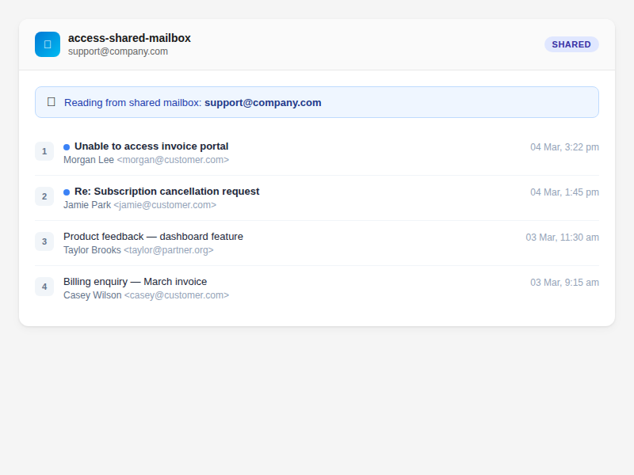

# How to Access Shared Mailboxes

Read and organise shared mailboxes like team inboxes, support queues, or service accounts that your Microsoft 365 account has access to.

> **Scope:** shared-mailbox support covers reading and organising (search, read, export, attachments, flags/categories, moves, delta, conversations, folder management). **Sending, drafts, replies, and forwards from a shared mailbox are not supported** — `send-email` and `draft` always act on the signed-in user's own mailbox.

## Read from a Shared Mailbox

> "Check the support inbox for new emails"

```
tool: access-shared-mailbox
params:
  sharedMailbox: "support@company.com"
```

This returns the 25 most recent emails from the shared mailbox's inbox.

## Browse a Specific Folder

```
tool: access-shared-mailbox
params:
  sharedMailbox: "support@company.com"
  folder: "Escalated"
```

## Control the Number of Results

```
tool: access-shared-mailbox
params:
  sharedMailbox: "team@company.com"
  count: 10
  outputVerbosity: "minimal"
```



## Required Permissions

Your Azure app registration needs the `Mail.Read.Shared` permission to **read** a shared mailbox, and `Mail.ReadWrite.Shared` to **organise** it (move messages between folders, apply categories, flag, mark read, create/delete folders). `Mail.Send.Shared` is deliberately **not** requested, because sending from a shared mailbox isn't supported:

1. Go to [Azure Portal → App registrations](https://portal.azure.com/#view/Microsoft_AAD_RegisteredApps/ApplicationsListBlade) → your Outlook Assistant app
2. Under **API permissions**, add the Microsoft Graph delegated permissions: `Mail.Read.Shared` (read) and `Mail.ReadWrite.Shared` (write)
3. Grant admin consent if required by your organisation
4. **Re-authenticate** (`auth` tool, `action=authenticate`) so the refreshed token carries the new scopes — existing tokens won't have them

Your Microsoft account must also have been granted access (Full Access / delegate) to the shared mailbox by your Exchange administrator.

## Parameter Reference

| Parameter | What it does | Default |
|-----------|-------------|---------|
| `sharedMailbox` | Email address of the shared mailbox (**required**) | — |
| `folder` | Folder to read from | `inbox` |
| `count` | Number of emails to return (max 50) | 25 |
| `outputVerbosity` | `minimal`, `standard`, or `full` | `standard` |

## Troubleshooting

| Problem | Cause | Fix |
|---------|-------|-----|
| "Access denied" or 403 error | Missing `Mail.Read.Shared` (read) / `Mail.ReadWrite.Shared` (write) permission | Add the permission in Azure Portal, then re-authenticate |
| "Mailbox not found" | Incorrect email address or no access granted | Verify the address and check with your Exchange admin |
| Empty results | Mailbox is empty or folder doesn't exist | Try `folder: "inbox"` to confirm access |
| `404 ErrorInvalidMailboxItemId` or "folder not found" on a move/categorize/flag | `sharedMailbox` was omitted, so the write addressed your own mailbox where the shared ID doesn't exist | Pass `sharedMailbox` on the write tool |
| 403 access denied on a move/categorize/flag with `sharedMailbox` set | Token lacks `Mail.ReadWrite.Shared` or delegate access is missing — the request stays shared-mailbox-scoped and fails; it does not fall back to your own mailbox | Add the scope in Azure, grant delegate access, and re-authenticate |

## Tips

- `access-shared-mailbox` itself is read-only, and you can't *send, draft, reply, reply-all, or forward* from a shared mailbox through Outlook Assistant — those tools always act on your own mailbox — but you can organise one: `folders action=move`, `folders action=create`, `apply-category`, and `update-email` (flag/mark-read) all accept `sharedMailbox` (alias `email`) with `Mail.ReadWrite.Shared`
- Use `outputVerbosity: "minimal"` for quick checks on high-volume shared inboxes
- Auto-approved by MCP clients that support annotations (read-only tool)

## Related

- [Find Emails](../email/find-emails.md) — search your personal mailbox
- [Verify Your Connection](../getting-started/verify-your-connection.md) — check permissions
- [Azure Setup Guide](../../guides/azure-setup.md) — managing app permissions
- [Tools Reference — access-shared-mailbox](../../quickrefs/tools-reference.md#advanced-2-tools)
