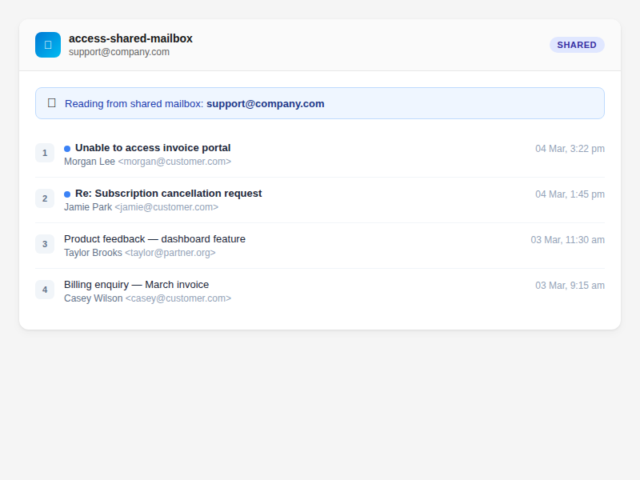

# How to Access Shared Mailboxes

Read and organise shared mailboxes like team inboxes, support queues, or service accounts that your Microsoft 365 account has access to.

> **Scope:** shared-mailbox support covers reading and organising (search, read, export, attachments, flags/categories, moves, delta, conversations, folder management). **Sending, drafts, replies, and forwards from a shared mailbox are not supported** — `send-email` and `draft` always act on the signed-in user's own mailbox.

## Turn On Shared-Mailbox Support

Shared-mailbox support is **opt-in** and works with **work/school (Microsoft 365) accounts only**. Without it, sign-in requests the standard scopes and nothing changes for you.

1. Add the setting to the MCP server's environment (for example the `env` block of your `.mcp.json`):
   - `OUTLOOK_SHARED_MAILBOX=read` — read, search, and export shared mailboxes (`Mail.Read.Shared`)
   - `OUTLOOK_SHARED_MAILBOX=true` — also organise them: move, flag, categorise, mark read, and manage folders (adds `Mail.ReadWrite.Shared`). `readwrite` and `1` mean the same.
2. Restart the server.
3. Re-authenticate so your token carries the new scopes: `auth action=authenticate force=true`. Existing tokens never gain them on their own, because a token refresh only asks for the scopes you were granted at sign-in.
4. Check `auth action=about` — the **Shared mailboxes** row shows whether each shared scope was actually granted.

Use the device-code flow (the default) to sign in. The browser flow (`npm run auth-server`) requests the configured scopes and has no fallback if your account or tenant rejects them. Personal Outlook.com accounts can't be granted these scopes, so leave the setting unset there.

If your organisation blocks user consent, an administrator has to grant consent for the shared scopes. If they won't, unset `OUTLOOK_SHARED_MAILBOX` and you'll sign in with the standard scopes again.

While the setting is off, `access-shared-mailbox` behaves as it always has (a well-known folder name or folder ID, using whatever access your existing token has). Every other tool's `sharedMailbox` parameter is refused with these setup steps.

## Read from a Shared Mailbox

> "Check the support inbox for new emails"

```
tool: access-shared-mailbox
params:
  sharedMailbox: "support@company.com"
```

This returns the 25 most recent emails from the shared mailbox's inbox. `email` is accepted as an alias for `sharedMailbox`.

## Discover the Folder Tree

> "What folders does the support mailbox have?"

```
tool: access-shared-mailbox
params:
  sharedMailbox: "support@company.com"
  listFolders: true
```

This lists the folders you can reach, with their full paths, IDs and item counts. The listing is best-effort: if a branch couldn't be traversed (depth limit, throttling, or a per-folder permission error), the output says so, so check for those warnings before concluding a folder doesn't exist. `folders action=list` with `sharedMailbox` gives the same tree.

`listFolders` needs `OUTLOOK_SHARED_MAILBOX` to be set.

## Browse a Specific Folder

Pass a well-known name, a custom or localised display name, or a nested path:

```
tool: access-shared-mailbox
params:
  sharedMailbox: "support@company.com"
  folder: "Inbox/Escalated/Priority"
```

Or use an exact folder ID from the listing, which skips name resolution:

```
tool: access-shared-mailbox
params:
  sharedMailbox: "support@company.com"
  folderId: "AAMkAGI2..."
```

Custom names and nested paths need `OUTLOOK_SHARED_MAILBOX`; with it off, `folder` must be a well-known name (`inbox`, `sentitems`, `archive`...) or you pass `folderId`.

## Control the Number of Results

```
tool: access-shared-mailbox
params:
  sharedMailbox: "team@company.com"
  count: 10
  outputVerbosity: "minimal"
```



## Search, Read and Export Shared Mail

For filtering and full message access, pass `sharedMailbox` (alias `email`) to the regular email tools:

```
tool: search-emails
params:
  sharedMailbox: "support@company.com"
  folder: "Inbox/Escalated"
  from: "vendor@example.com"
```

`search-emails` supports `sharedMailbox` in every mode: list and search, `searchAllFolders`, `deltaMode`, `conversationId`, `groupByConversation` and `internetMessageId`.

Message IDs belong to the mailbox they came from. When you open a message you found in a shared mailbox, pass the **same** `sharedMailbox` to:

- `read-email`, including `headersMode` for forensic headers
- `attachments` (list, view, download)
- `export` (every target: `message`, `messages`, `conversation`, `mime`)

Leaving it out makes the tool look the ID up in your own mailbox, which fails with `404 ErrorInvalidMailboxItemId`.

## Organise a Shared Mailbox

With `OUTLOOK_SHARED_MAILBOX=true`, these accept `sharedMailbox` too:

- `update-email`: mark read or unread, flag, unflag, complete
- `apply-category`: set, add or remove categories. The category names must already exist in the shared mailbox's master list, because `manage-category` only manages your own.
- `folders`: all five actions (`list`, `create`, `move`, `stats`, `delete`). Protected folders such as Inbox can't be deleted, just as in your own mailbox.

```
tool: folders
params:
  action: "move"
  sharedMailbox: "support@company.com"
  emailIds: "AAMkAGI2...,AAMkAGI3..."
  targetFolder: "Inbox/Resolved"
```

A shared-mailbox write always stays in the shared mailbox. If the token lacks `Mail.ReadWrite.Shared` it fails (usually 403); it never falls back to your own mailbox.

## Required Permissions

Your Azure app registration needs the `Mail.Read.Shared` permission to **read** a shared mailbox, and `Mail.ReadWrite.Shared` to **organise** it (move messages between folders, apply categories, flag, mark read, create/delete folders). `Mail.Send.Shared` is deliberately **not** requested, because sending from a shared mailbox isn't supported:

1. Go to [Azure Portal → App registrations](https://portal.azure.com/#view/Microsoft_AAD_RegisteredApps/ApplicationsListBlade) → your Outlook Assistant app
2. Under **API permissions**, add the Microsoft Graph delegated permissions: `Mail.Read.Shared` (read) and `Mail.ReadWrite.Shared` (write)
3. Grant admin consent if required by your organisation
4. Set `OUTLOOK_SHARED_MAILBOX` (see [Turn On Shared-Mailbox Support](#turn-on-shared-mailbox-support)) and **re-authenticate** (`auth action=authenticate force=true`) so the token carries the new scopes — existing tokens won't have them

Your Microsoft account must also have been granted access (Full Access / delegate) to the shared mailbox by your Exchange administrator.

## Parameter Reference

`access-shared-mailbox`:

| Parameter | What it does | Default |
|-----------|-------------|---------|
| `sharedMailbox` | Email address of the shared mailbox (**required**; alias `email`) | — |
| `folder` | Folder to read from: well-known name, display name or nested path | `inbox` |
| `folderId` | Exact folder ID; takes precedence over `folder` | — |
| `listFolders` | List the folder tree instead of messages | `false` |
| `count` | Number of emails to return (max 50) | 25 |
| `outputVerbosity` | `minimal`, `standard`, or `full` | `standard` |

The shared mailbox address must be a plain email address in printable ASCII (for example `team@contoso.com`). User GUIDs aren't accepted.

## Troubleshooting

| Problem | Cause | Fix |
|---------|-------|-----|
| "Shared-mailbox support is turned off" | `OUTLOOK_SHARED_MAILBOX` isn't set | Follow [Turn On Shared-Mailbox Support](#turn-on-shared-mailbox-support) |
| "Access denied" or 403 error | Missing `Mail.Read.Shared` (read) / `Mail.ReadWrite.Shared` (write) permission, or no delegate access | Add the permission in Azure Portal, check `auth action=about`, then re-authenticate with `force=true` |
| "Mailbox not found" | Incorrect email address or no access granted | Verify the address and check with your Exchange admin |
| `Invalid mailbox "…"` | The address isn't a plain printable-ASCII email address | Retype it without spaces, look-alike characters, `#`, `%` or `/` |
| Empty results | Mailbox is empty or folder doesn't exist | Try `folder: "inbox"`, or `listFolders: true` to see what's there |
| `404 ErrorInvalidMailboxItemId` or "folder not found" on a read, move, categorise or flag | `sharedMailbox` was omitted, so the call addressed your own mailbox where the shared ID doesn't exist | Pass the same `sharedMailbox` on every call that uses an ID from the shared mailbox |
| 403 access denied on a move/categorise/flag with `sharedMailbox` set | Token lacks `Mail.ReadWrite.Shared` (for example `OUTLOOK_SHARED_MAILBOX=read`) or delegate access is missing — the request stays shared-mailbox-scoped and fails; it does not fall back to your own mailbox | Set `OUTLOOK_SHARED_MAILBOX=true`, add the scope in Azure, grant delegate access, and re-authenticate |

## Tips

- `access-shared-mailbox` itself is read-only and auto-approved by MCP clients that support annotations
- You can't *send, draft, reply, reply-all, or forward* from a shared mailbox through Outlook Assistant — those tools always act on your own mailbox. Use the Outlook UI for send-as or send-on-behalf.
- Use `outputVerbosity: "minimal"` for quick checks on high-volume shared inboxes
- Mailbox settings, inbox rules and Focused Inbox always apply to your own mailbox

## Related

- [Find Emails](../email/find-emails.md) — search options that also work with `sharedMailbox`
- [Organise with Folders](../organise/organise-with-folders.md) — folder actions
- [Verify Your Connection](../getting-started/verify-your-connection.md) — check permissions
- [Azure Setup Guide](../../guides/azure-setup.md) — managing app permissions
- [Tools Reference — access-shared-mailbox](../../quickrefs/tools-reference.md#advanced-2-tools)
