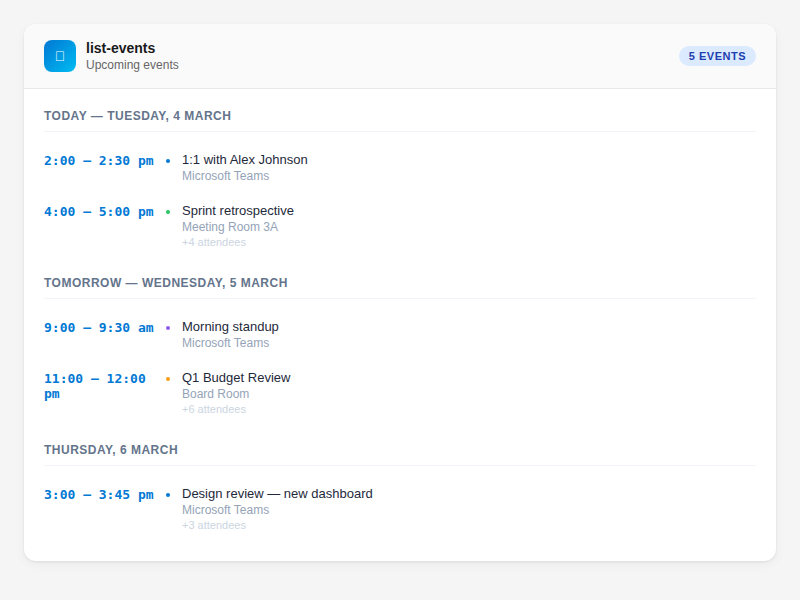

# How to View and Search Calendar Events

Check what's coming up on your calendar, look back at what already happened, or find a specific meeting by name, so your AI assistant can help with scheduling, preparation, or summarising your day.

## List Your Next Events

> "What's on my calendar this week?"

```
tool: list-events
```

With no parameters, this returns your next 10 upcoming events (start time from now onwards), soonest first.

## See More Events

> "Show me my next 30 events"

```
tool: list-events
params:
  count: 30
```

Maximum is 50 events per request.

## Look Back at Past Events

> "What meetings did I have last week?"

Bound a window with `startAfter` and `startBefore`. Results come back oldest first:

```
tool: list-events
params:
  startAfter: "2026-09-21T00:00:00+10:00"
  startBefore: "2026-09-28T00:00:00+10:00"
```

`startAfter` matches events starting at or after that time; `startBefore` matches events starting strictly before it.

To see your most recent past events, pass only `startBefore`. The search then looks backwards, so the newest events come first:

```
tool: list-events
params:
  startBefore: "2026-10-02T00:00:00Z"
  count: 5
```

## Find Events by Name

> "When was the last quarterly planning meeting?"

```
tool: list-events
params:
  subject: "quarterly planning"
```

`subject` is a case-insensitive "contains" match (up to 255 characters). On its own it searches your whole calendar, past and future, latest start time first. Combine it with `startAfter`/`startBefore` to narrow the range.

## How the Filters Work

- **No filter**: upcoming events only, exactly as before v3.12.0.
- **Any filter**: replaces the implicit "from now" bound, so past events are included. Filters are combined (AND).
- **Dates need a timezone**: use ISO 8601 with `Z` or a ±hh:mm offset, such as `2026-01-01T00:00:00Z` or `2026-01-01T09:00:00+10:00`. They're converted to UTC before the search. Zone-less (`2026-01-01T09:00:00`) and date-only (`2026-01-01`) values are rejected rather than guessed, as are impossible dates such as 30 February and dates before 1900. `startAfter` must be earlier than `startBefore`.
- **Invalid arguments fail fast**: the tool returns an error explaining what's wrong before anything is sent to Microsoft Graph.

Your AI assistant converts "last week" or "yesterday" into these timestamps for you.

## What's Included in Each Event

Each event shows:

- **Subject**: the meeting title
- **Location**: room or place name, or "No location"
- **Start/End**: a UTC timestamp (for example `2026-04-02T22:00:00.000Z`) followed by the same time in your configured timezone (default Australia/Melbourne; override with `OUTLOOK_DEFAULT_TIMEZONE`). The UTC value is authoritative.
- **Summary**: the start of the event description
- **ID**: pass this to `manage-event` to update, decline, cancel or delete the event



## Parameter Reference

| Parameter | What it does | Default |
|-----------|-------------|---------|
| `count` | Number of events to return (max 50) | 10 |
| `startAfter` | Only events starting at or after this time (ISO 8601 with `Z` or ±hh:mm) | now, when no filter is given |
| `startBefore` | Only events starting before this time (ISO 8601 with `Z` or ±hh:mm) | — |
| `subject` | Case-insensitive text the subject must contain (max 255 characters) | — |

## Tips

- `list-events` is read-only and auto-approved, so no confirmation is needed
- Ask your AI assistant to summarise your day: "What meetings do I have today?"
- Combine with email search: "Find any emails from people I'm meeting today"
- Prepare for a recurring meeting by finding the last one: "When did we last have the vendor review, and what was in the invite?"

## Related

- [Create Calendar Events](create-calendar-events.md) — schedule new meetings
- [Manage Event Responses](manage-event-responses.md) — update, decline, cancel or delete events
- [Find Meeting Rooms](../advanced/find-meeting-rooms.md) — search for available rooms
- [Tools Reference — list-events](../../quickrefs/tools-reference.md#calendar-3-tools)
