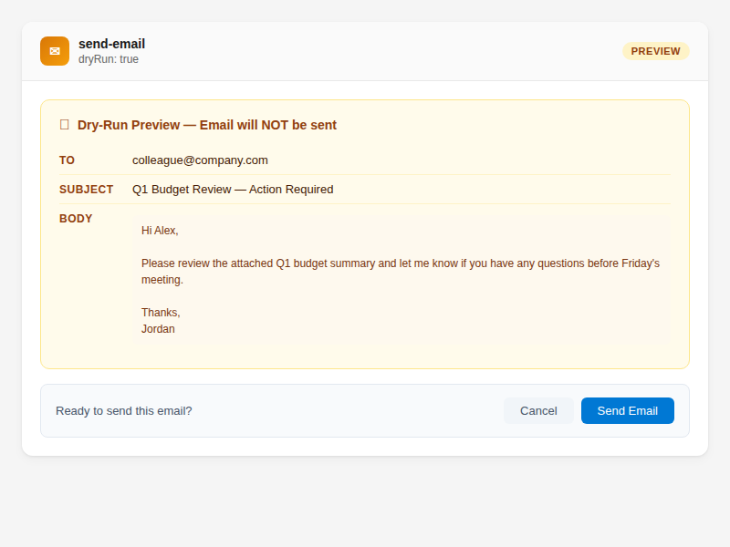
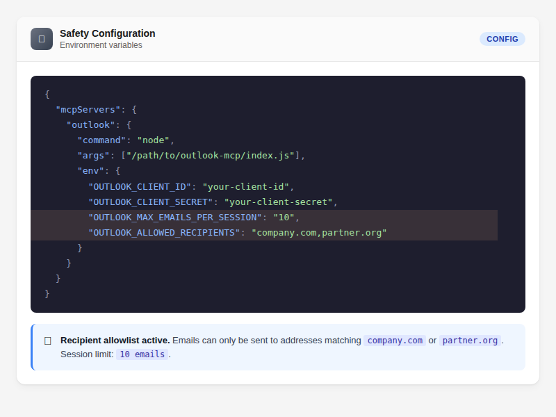

# How to Send Email Safely

Compose and send emails through your AI assistant with built-in safety controls: dry-run preview, rate limiting, and an optional recipient allowlist.

## Check Recipients Before Sending

Before sending to unfamiliar recipients or large groups, check for potential issues:

> "Check if sarah@company.com and team@company.com are available before I send"

```
tool: get-mail-tips
params:
  recipients: ["sarah@company.com", "team@company.com"]
```

This checks for out-of-office, full mailboxes, delivery restrictions, moderation, external recipients, and group sizes. See [Check Recipients Before Sending](check-recipients-before-sending.md) for the full guide.

You can also combine this with dry-run for a complete pre-send review:

```
tool: send-email
params:
  to: "sarah@company.com"
  subject: "Project Update"
  body: "Hi Sarah..."
  dryRun: true
  checkRecipients: true
```

Without `dryRun`, `checkRecipients: true` refuses to send when the tips show an out-of-office reply, a full mailbox, a delivery restriction, an external recipient or a group with external members. The error lists what was flagged; nothing is sent. Once you've seen the warnings, repeat the call with `acknowledgeWarnings: true` to send anyway. Personal Outlook.com accounts return no tips, and no warnings is not proof the email will be delivered. See [When send-email Refuses to Send](check-recipients-before-sending.md#when-send-email-refuses-to-send).

## Preview Before Sending (Dry Run)

Always preview first to check the email looks right:

> "Draft an email to sarah@company.com about the project update — don't send it yet"

```
tool: send-email
params:
  to: "sarah@company.com"
  subject: "Project Alpha Update"
  body: "Hi Sarah,\n\nHere's the latest on Project Alpha..."
  dryRun: true
```

The dry run shows exactly what will be sent — recipients, subject, body — without actually sending. Review it, then ask your AI assistant to send.



## Send an Email

> "Send an email to sarah@company.com about the meeting tomorrow"

```
tool: send-email
params:
  to: "sarah@company.com"
  subject: "Meeting Tomorrow"
  body: "Hi Sarah,\n\nJust confirming our meeting tomorrow at 10am.\n\nCheers"
```

`send-email` is marked as destructive, so clients that honour MCP annotations (such as Claude Code with its default permissions) ask for your confirmation before sending, even without dry run. Whether you're asked depends on your client and its permission settings — see [Confirmation Prompt](#confirmation-prompt) below.

## Send to Multiple Recipients

Use commas to separate addresses:

```
tool: send-email
params:
  to: "sarah@company.com, james@company.com"
  cc: "manager@company.com"
  subject: "Team Update"
  body: "Hi team,\n\n..."
```

| Field | Purpose |
|-------|---------|
| `to` | Primary recipients |
| `cc` | Carbon copy — visible to all |
| `bcc` | Blind carbon copy — hidden from other recipients |

## Set Email Importance

```
tool: send-email
params:
  to: "team@company.com"
  subject: "Urgent: Server outage"
  body: "..."
  importance: "high"
```

Options: `normal` (default), `high`, `low`.

## Safety Controls

### Confirmation Prompt

`send-email` carries the MCP `destructiveHint` annotation. Annotations are hints: the server sets them, and your MCP client decides what to do with them. Clients that honour them prompt before a destructive tool runs, but a client can also be configured to auto-approve the tool or to run in a mode that skips prompts, and then the email is sent without asking. Keep `send-email` and `draft` on "ask" in your client's permission settings if you want to approve every send.

In Claude Code, `send-email` (and `create-event`) also carry the `anthropic/requiresUserInteraction` flag, so Claude Code asks before every call, dry runs included, even in auto-accept or bypass modes. Other clients ignore this flag. `draft` doesn't carry it, so `draft action=send` follows your normal permission settings.

On the server side, `send-email` offers `dryRun` previews and enforces the session rate limit and the recipient allowlist below, whatever your client does.

### Read-Only Mode

To rule out sending altogether, set:

```
OUTLOOK_READ_ONLY=true
```

The server then refuses every call that would change something, including `send-email`, every `draft` action and `dryRun` previews, before anything reaches Microsoft. Reads still work. Remove it and restart the server to send again.

### Rate Limiting

Set a per-session send limit to prevent runaway sends:

```
OUTLOOK_MAX_EMAILS_PER_SESSION=10
```

Add this to your MCP server environment variables. Once the limit is reached, further sends are refused with a "Rate limit reached" error until the server restarts. Sending a draft (`draft action=send`) counts towards the same limit. The value is also the default cap for `draft` create/update and `manage-rules`, each counted separately; set `OUTLOOK_MAX_<TOOL>_PER_SESSION` (for example `OUTLOOK_MAX_SEND_EMAIL_PER_SESSION`) to override one tool.

### Recipient Allowlist

Restrict who your AI assistant can send to:

```
OUTLOOK_ALLOWED_RECIPIENTS=company.com,partner.org
```

With this set, emails can only be sent to addresses ending in `@company.com` or `@partner.org`. Sends to any other domain are blocked.



### Save to Sent Items

By default, sent emails appear in your Sent Items folder. To suppress:

```
tool: send-email
params:
  to: "..."
  subject: "..."
  body: "..."
  saveToSentItems: false
```

## Parameter Reference

| Parameter | What it does | Default |
|-----------|-------------|---------|
| `to` | Recipient addresses (comma-separated) | **(required)** |
| `subject` | Email subject line | **(required)** |
| `body` | Email body (plain text or HTML) | **(required)** |
| `cc` | CC addresses (comma-separated) | — |
| `bcc` | BCC addresses (comma-separated) | — |
| `importance` | `normal`, `high`, or `low` | `normal` |
| `dryRun` | Preview without sending | `false` |
| `checkRecipients` | Check recipients for issues before sending | `false` |
| `saveToSentItems` | Save to Sent Items folder | `true` |

## Draft Before Sending

For important emails, consider saving as a draft first — then review in Outlook before sending:

```
tool: draft
params:
  action: "create"
  to: "sarah@company.com"
  subject: "Project Update"
  body: "Hi Sarah..."
```

Then send when ready: `draft(action: "send", id: "draft-id")`. See [Create and Manage Email Drafts](create-draft-emails.md) for the full guide.

## Tips

- Use `checkRecipients: true` with `dryRun: true` for a complete pre-send review
- For emails that need careful review, use the `draft` tool instead — it saves a real draft in Outlook
- Always use `dryRun: true` for important emails to review before sending
- Set `OUTLOOK_MAX_EMAILS_PER_SESSION` to prevent accidental bulk sends
- Use `OUTLOOK_ALLOWED_RECIPIENTS` in shared or automated environments
- HTML is supported in the body — use it for formatted emails

## Related

- [Create and Manage Email Drafts](create-draft-emails.md) — save drafts for review before sending
- [Check Recipients Before Sending](check-recipients-before-sending.md) — full mail tips guide
- [Find Emails](find-emails.md) — search for emails to reply to
- [Read Email Threads](read-email-threads.md) — read a thread before replying
- [Batch Operations](../advanced/batch-operations.md) — bulk email operations
- [Tools Reference — send-email](../../quickrefs/tools-reference.md#email-8-tools)
