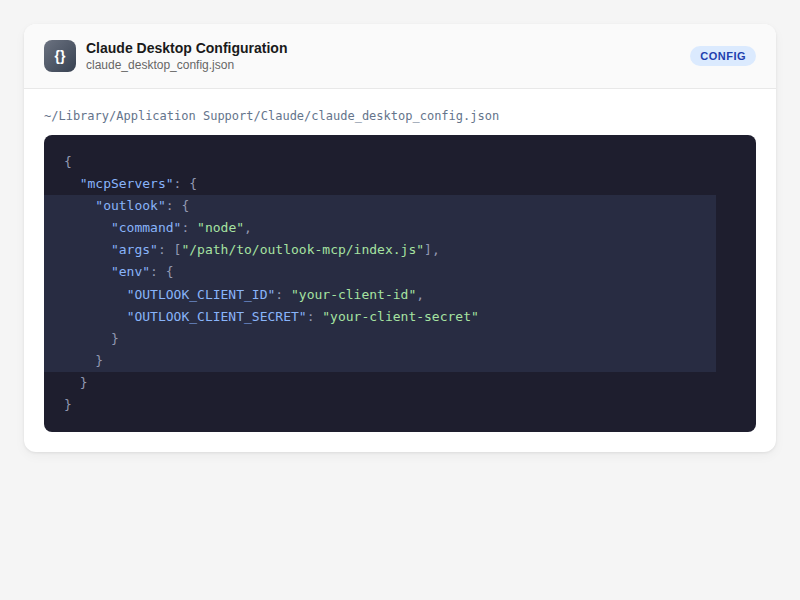
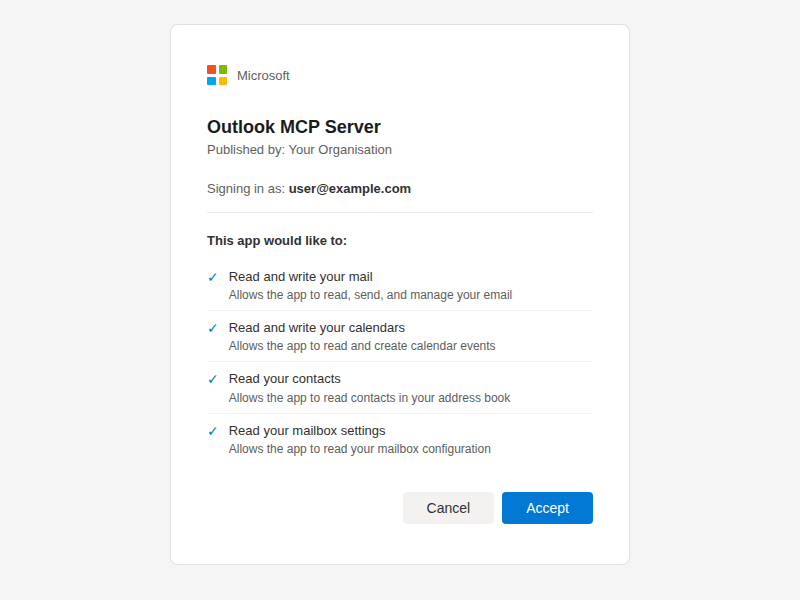
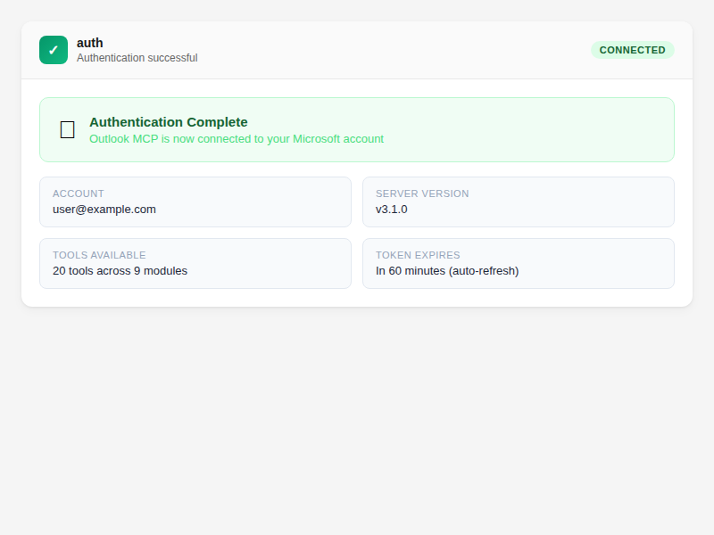

# How to Connect Outlook to Your AI Assistant

Connect your Microsoft 365 or Outlook.com account so your AI assistant can search emails, manage your calendar, and work with contacts on your behalf.

## Install Outlook Assistant

Install the package globally:

```bash
npm install -g @littlebearapps/outlook-assistant
```

Or clone and install locally:

```bash
git clone https://github.com/littlebearapps/outlook-assistant.git
cd outlook-assistant
npm install
```

## Register an Azure App

Outlook Assistant needs an Azure app registration to access the Microsoft Graph API. This is free and takes about 10 minutes.

Follow the full walkthrough in the [Azure Setup Guide](../../guides/azure-setup.md), or the short version:

1. Go to [Azure Portal → App registrations](https://portal.azure.com/#view/Microsoft_AAD_RegisteredApps/ApplicationsListBlade)
2. Click **New registration** (no redirect URI needed at this stage)
3. Copy the **Application (client) ID** from the app's **Overview** page. *Browser flow only:* under **Certificates & secrets**, also create a client secret and copy its **Value** (not the Secret ID). The default device code sign-in doesn't use a secret.
4. Under **Authentication** > **Add a platform** > **Mobile and desktop applications** — check `https://login.microsoftonline.com/common/oauth2/nativeclient`
5. Under **Authentication** > **Advanced settings** — set **"Allow public client flows"** to **Yes**
6. Under **API permissions**, add these Microsoft Graph **delegated** permissions:
   - `offline_access` — refresh tokens between sessions
   - `User.Read` — basic profile
   - `Mail.Read`, `Mail.ReadWrite`, `Mail.Send` — email operations
   - `Calendars.Read`, `Calendars.ReadWrite` — calendar operations
   - `Contacts.Read`, `Contacts.ReadWrite` — contact management
   - `MailboxSettings.ReadWrite` — settings, categories, auto-replies
   - `People.Read` — people search

**Optional** (work/school accounts only):
   - `Mail.Read.Shared` — shared mailbox read access
   - `Mail.ReadWrite.Shared` — shared mailbox writes (move/categorise/flag/mark-read)
   - `Place.Read.All` — meeting room search (requires admin consent)

   The two `.Shared` scopes are only requested when you opt in with `OUTLOOK_SHARED_MAILBOX` — see [Access Shared Mailboxes](../advanced/access-shared-mailboxes.md).

> **Common mistake**: If you create a client secret, copy its **Value**, not the Secret ID. Using the wrong one causes `AADSTS7000215` errors.

## Add to Your AI Tool

### Claude Desktop

Add to your `claude_desktop_config.json`:

```json
{
  "mcpServers": {
    "outlook": {
      "command": "npx",
      "args": ["-y", "@littlebearapps/outlook-assistant"],
      "env": {
        "OUTLOOK_CLIENT_ID": "your-client-id",
        "OUTLOOK_CLIENT_SECRET": "your-secret-value"
      }
    }
  }
}
```



### Claude Code

Add with the CLI:

```bash
claude mcp add outlook \
  -e OUTLOOK_CLIENT_ID=your-client-id \
  -e OUTLOOK_CLIENT_SECRET=your-secret-value \
  -- npx -y @littlebearapps/outlook-assistant
```

Or add to your `.mcp.json` or project settings:

```json
{
  "mcpServers": {
    "outlook": {
      "command": "npx",
      "args": ["-y", "@littlebearapps/outlook-assistant"],
      "env": {
        "OUTLOOK_CLIENT_ID": "your-client-id",
        "OUTLOOK_CLIENT_SECRET": "your-secret-value"
      }
    }
  }
}
```

### Other MCP Clients

Any MCP-compatible client can use Outlook Assistant. Set the command to `npx -y @littlebearapps/outlook-assistant` and pass the environment variables in the client's `env` settings. The MCP server doesn't read a `.env` file.

`OUTLOOK_CLIENT_SECRET` is only used by the [browser redirect flow](#browser-redirect-flow-alternative). With device code sign-in (the default) you can leave it out and set just `OUTLOOK_CLIENT_ID`.

### Clients That Can't Set Environment Variables

Some clients, such as the GitHub Copilot and Cursor plugin marketplaces, install the server with a fixed configuration and give you nowhere to enter `OUTLOOK_CLIENT_ID`. In that case, give the client ID to your AI assistant when you sign in:

> "Connect to my Outlook account. My Azure Application (client) ID is 00000000-0000-0000-0000-000000000000"

Your AI assistant calls the `auth` tool with `action: authenticate, clientId: <your ID>`. If you don't mention the ID, sign-in reports that `OUTLOOK_CLIENT_ID` is not configured and your assistant should ask you for it.

- The ID is saved to `~/.outlook-assistant-config.json` (owner read/write only) and used from then on, including for token refresh, without restarting the server. It identifies your app registration and isn't a secret.
- Only device code sign-in works this way. The browser flow also needs the client secret, which the auth server reads from its own environment.
- `OUTLOOK_CLIENT_ID` takes precedence when it's set. If it holds a different ID, the `auth` tool refuses the new one rather than saving an ID that would be ignored. Change or remove the environment variable instead.
- `auth action=about` shows whether the client ID comes from the environment or the saved file (never the ID itself). To forget a saved ID, delete `~/.outlook-assistant-config.json`.

Optional settings such as `OUTLOOK_AUTH_AUDIENCE`, `OUTLOOK_DEFAULT_TIMEZONE`, the send safety belts and `OUTLOOK_SHARED_MAILBOX` go in the same `env` block — see the [README's environment variables table](../../../README.md#environment-variables).

## Authenticate for the First Time

### Device Code Flow (Recommended)

The device code flow works everywhere — no auth server, no SSH tunnels, no port forwarding. Ideal for remote, headless, and standard setups alike.

> **Azure prerequisite**: In Azure Portal > App registrations > your app > **Authentication** > Advanced settings, set **"Allow public client flows"** to **Yes**.

1. Ask your AI assistant to authenticate:

> "Connect to my Outlook account"

Your AI assistant will call the `auth` tool with `action: authenticate`. You'll receive a short code and a URL.

2. Visit the URL (https://microsoft.com/devicelogin) in a **private/incognito browser window**, on any device — it doesn't need to be the same machine running Outlook Assistant.

> **Tip**: Use incognito/private browsing to avoid cached sessions from previous OAuth flows interfering with device code sign-in.

3. Enter the code, sign in with your Microsoft account, and grant permissions.



4. Tell your AI assistant you've completed sign-in. It will call `auth` with `action: device-code-complete` to finish authentication. Tokens are saved to `~/.outlook-assistant-tokens.json`.

> **Server restarts** (v3.7.2+): Device code state is persisted to disk, so `device-code-complete` works even if the MCP server restarts between steps 1 and 4.

### Browser Redirect Flow (Alternative)

If you prefer the traditional OAuth browser redirect (e.g. for localhost development):

1. Start the auth server. From a source checkout:

```bash
npm run auth-server
```

From a global npm install:

```bash
node "$(npm root -g)/@littlebearapps/outlook-assistant/outlook-auth-server.js"
```

> **Important**: The auth server needs `OUTLOOK_CLIENT_ID` and `OUTLOOK_CLIENT_SECRET` environment variables. Either:
> - Create a `.env` file in the directory you start it from (copy from `.env.example`), or
> - Export the variables in your shell before running the command
>
> The `outlook-assistant` command itself only accepts `--version` and `--help`, so `npx @littlebearapps/outlook-assistant auth-server` exits with an error.
>
> The browser flow requests the configured scopes with no fallback. If you've enabled `OUTLOOK_SHARED_MAILBOX`, use the device code flow instead.

2. Ask your AI assistant:

> "Connect to my Outlook account using browser auth"

Your AI assistant will call the `auth` tool with `action: authenticate, method: browser` and return a URL.

3. Open the URL in your browser, sign in, and grant permissions. After granting access, the browser redirects to `localhost:3333` and tokens are saved automatically to `~/.outlook-assistant-tokens.json`.

4. You can stop the auth server after authentication succeeds.

## Understanding the Processes

| Process | Purpose | When to run |
|---------|---------|-------------|
| **MCP server** (`index.js`) | Handles all 22 Outlook tools | Always — your MCP client starts it automatically |
| **Auth server** (`outlook-auth-server.js`) | Handles browser OAuth redirect flow | Only if using `method=browser` during authentication |

**Key points:**
- With **device code flow** (default), you only need the MCP server — no auth server needed at all.
- The **auth server** is only required for the browser redirect flow. It runs on port 3333 to receive the OAuth callback.
- **Tokens auto-refresh** in the background. You rarely need to re-authenticate (only after ~90 days of inactivity).

## Verify It's Working

Ask your AI assistant:

> "Check my Outlook connection status"

The `auth` tool is called with `action: status`. You should see "Authenticated and ready" with the time until the token expires. To confirm which mailbox is connected, ask for the server info (`auth` with `action: about`).



Then try a simple read:

> "Show me my last 5 emails"

If you see your recent emails, everything is connected.

## Troubleshooting

| Problem | Solution |
|---------|----------|
| "OUTLOOK_CLIENT_ID is not configured" | Set `OUTLOOK_CLIENT_ID` in your client's `env` block, or give your assistant the Application (client) ID so it can call `auth action=authenticate clientId=<id>` (see [Clients That Can't Set Environment Variables](#clients-that-cant-set-environment-variables)) |
| `AADSTS7000215` (invalid secret) | Use the secret **Value**, not the Secret ID |
| `EADDRINUSE :3333` | Run `npx kill-port 3333` then restart the auth server |
| Auth URL doesn't open | Browser flow only: start the auth server first (`npm run auth-server` from source). The default device code flow uses `microsoft.com/devicelogin` and needs no auth server |
| `unrecognised argument` when starting the server | The `outlook-assistant` command only accepts `--version` and `--help`; see the browser-flow steps above for starting the auth server |
| Permissions error after login | Check API permissions in Azure Portal and grant admin consent if required |
| Token file not found | Tokens are stored at `~/.outlook-assistant-tokens.json` — check the file exists after auth |

## Related

- [Azure Setup Guide](../../guides/azure-setup.md) — full Azure walkthrough with screenshots
- [Verify Your Connection](verify-your-connection.md) — check auth status and re-authenticate
- [Find Emails](../email/find-emails.md) — your first search after connecting
- [Tools Reference](../../quickrefs/tools-reference.md) — all 22 tools with parameters
