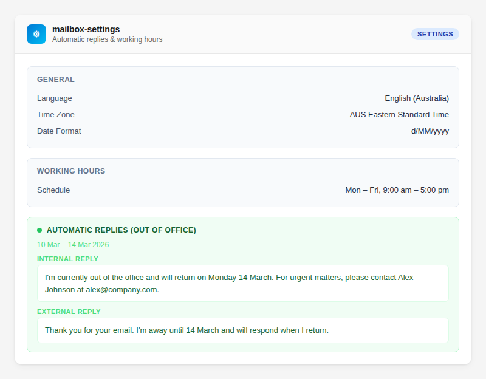

# How to Set an Out-of-Office Reply

Enable automatic replies so people know you're away. Set separate messages for colleagues and external contacts, and schedule replies for specific dates.

## Enable an Immediate Out-of-Office

> "Turn on my out-of-office reply"

```
tool: mailbox-settings
params:
  action: "set-auto-replies"
  enabled: true
  internalReplyMessage: "I'm currently out of the office and will respond when I return."
```

This turns on auto-replies immediately and keeps them on until you disable them.

## Schedule Auto-Replies for Specific Dates

> "Set my out-of-office from March 10 to March 15"

```
tool: mailbox-settings
params:
  action: "set-auto-replies"
  enabled: true
  startDateTime: "2026-03-10T00:00:00Z"
  endDateTime: "2026-03-15T23:59:59Z"
  internalReplyMessage: "I'm on leave from 10–15 March. Back Monday 16th."
```

Scheduled mode automatically activates and deactivates at the specified times.

## Set Separate Messages for Internal and External Senders

> "Set different out-of-office messages for internal and external people"

```
tool: mailbox-settings
params:
  action: "set-auto-replies"
  enabled: true
  startDateTime: "2026-03-10T00:00:00Z"
  endDateTime: "2026-03-15T23:59:59Z"
  internalReplyMessage: "On leave. For urgent issues, contact James (james@company.com)."
  externalReplyMessage: "Thank you for your email. I'm currently out of the office and will respond after 15 March."
  externalAudience: "all"
```

## Control Who Gets the External Reply

| `externalAudience` | Who receives the external message |
|--------------------|----------------------------------|
| `none` | Nobody outside your organisation |
| `contactsOnly` | Only people in your contacts |
| `all` | Everyone outside your organisation |

If you omit `externalAudience`, the existing setting is preserved. If no external message is set, external senders receive no auto-reply.

## Preview Before You Switch Them On

Automatic replies go to other people, including senders outside your organisation, until they're switched off. Add `dryRun: true` to see what a call would do without changing anything:

```
tool: mailbox-settings
params:
  action: "set-auto-replies"
  startDateTime: "2026-03-10T00:00:00Z"
  endDateTime: "2026-03-15T23:59:59Z"
  internalReplyMessage: "I'm on leave from 10–15 March."
  externalAudience: "all"
  dryRun: true
```

The preview starts with `DRY RUN — nothing was changed.` and shows:

- the status (off, on with no end date, or the schedule in UTC)
- who gets each reply: internal senders, and the external audience (`none`, `contactsOnly` or `all`)
- each message's length in characters and its first 100 characters

Anything the call doesn't set keeps its current value, so the preview reads the current setting first and marks those parts "unchanged".

## Disable Auto-Replies

> "Turn off my out-of-office"

```
tool: mailbox-settings
params:
  action: "set-auto-replies"
  enabled: false
```

## Check Current Auto-Reply Status

> "What's my current out-of-office status?"

```
tool: mailbox-settings
params:
  action: "get"
  section: "automaticRepliesSetting"
```

This shows whether auto-replies are enabled, the schedule, and the current messages.



## Parameter Reference

| Parameter | What it does | Example |
|-----------|-------------|---------|
| `action` | Must be `set-auto-replies` | `"set-auto-replies"` |
| `enabled` | Turn on (`true`) or off (`false`) | `true` |
| `startDateTime` | When auto-replies activate (ISO 8601) | `"2026-03-10T00:00:00Z"` |
| `endDateTime` | When auto-replies stop (ISO 8601) | `"2026-03-15T23:59:59Z"` |
| `internalReplyMessage` | Message for people in your organisation | `"On leave until Monday."` |
| `externalReplyMessage` | Message for people outside your organisation | `"Out of office until 15 March."` |
| `externalAudience` | Who gets the external reply: `none`, `contactsOnly`, `all` | `"all"` |
| `dryRun` | Preview who would get replies, the schedule and message lengths without changing anything | `true` |

## Tips

- Omit `startDateTime` and `endDateTime` to enable immediately (always-on mode)
- Include `startDateTime` and `endDateTime` for scheduled auto-activate/deactivate
- You can include HTML in your reply messages for formatting
- Check your current status with `action: "get"` before making changes
- `mailbox-settings` is marked destructive because automatic replies go to other people, so clients that honour MCP annotations ask before running it, even for `get`
- If you enable auto-replies without providing a message, the server warns you — it will note if a previously configured message will be reused, or warn that recipients will receive a blank reply

## Related

- [Configure Working Hours](configure-working-hours.md) — set your work schedule
- [Verify Your Connection](../getting-started/verify-your-connection.md) — ensure you're authenticated
- [Tools Reference — mailbox-settings](../../quickrefs/tools-reference.md#settings-1-tool)
